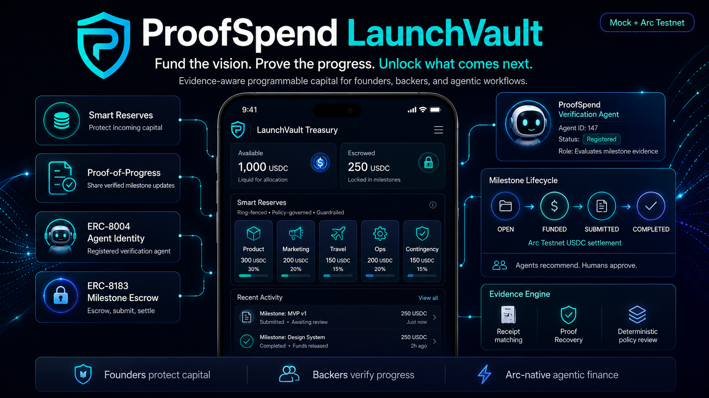

# ProofSpend LaunchVault

**Fund the vision. Prove the progress. Unlock what comes next.**

<p align="center">
  
</p>

<p align="center"><em>Product vision — mock foundation complete; Arc Testnet capabilities are in active development.</em></p>

ProofSpend LaunchVault is an evidence-aware programmable capital platform for founders, solopreneurs, and the people who fund their work. It connects business capital, milestone requirements, receipts, deliverables, LLM-assisted evidence analysis, deterministic policy, human approval, and Arc Testnet settlement into one accountable workflow.

> **Current status:** The technical foundation and Arc-native architecture are complete, and Issue #32 ships a bounded server-side Verification Agent orchestrator for the seeded PawPOVAI flow. The app defaults to explicit mock adapter mode, no real funds are being moved, and human approval plus typed adapter execution remain outside the model loop.

## Why ProofSpend

Founders often manage business funding across receipts, spreadsheets, wallets, messages, and disconnected applications. That makes it difficult to answer three important questions:

1. What was the money intended to support?
2. What progress and evidence exist?
3. Should the next funding tranche be released?

ProofSpend is designed to turn those scattered records into verifiable, privacy-conscious Proof-of-Progress without allowing artificial intelligence to independently control money.

## Design lineage and AI role

ProofSpend carries forward the deterministic preflight, plain-language risk communication, and human-oversight principles first explored in **SendSure**. That influence is conceptual and vocabulary-based: ProofSpend does not present itself as a SendSure fork and does not rely on SendSure code unless a future change explicitly imports and documents it.

The LLM remains an important assistant. It can read unstructured evidence, extract candidate facts, map evidence to requirements, identify ambiguity, ask a focused Proof Recovery question, explain results, and prepare a proposed next action. It does not produce the formal financial-policy decision, approve money movement, or submit a transaction.

## The core workflow

```text
Fund capital
    ↓
Allocate purpose-based Smart Reserves
    ↓
Define milestone requirements
    ↓
Collect receipts, deliverables, transactions, and business purpose
    ↓
Use the Verification Agent and LLM to extract facts, map evidence, and identify gaps
    ↓
Evaluate validated facts with deterministic policy
    ↓
Obtain explicit authorized human approval for the exact intent
    ↓
Submit and confirm the Arc Testnet action through the typed Circle adapter
    ↓
Share a selective Proof-of-Progress record with backers
```

## Planned product capabilities

### Smart Reserves
Organize incoming capital into protected categories such as product, marketing, travel, operations, and contingency while clearly separating available, allocated, escrowed, and settled funds.

### Evidence Engine
Connect receipts, deliverables, transaction records, and business-purpose statements to milestone requirements. The LLM produces structured evidence candidates and explanations; deterministic services validate the candidates and own the formal policy result. Missing or uncertain proof is routed through a guided Proof Recovery workflow.

### Proof-of-Progress
Create privacy-safe records that show what was completed, what evidence supported the decision, which policy rules passed, and what funding action followed—without exposing raw private receipts.

### ERC-8004 verification-agent identity
Register the ProofSpend Verification Agent with an onchain identity and clear capability metadata. Agent identity answers who performed the evidence evaluation; it does not grant independent authority to move funds or write self-reputation.

### ERC-8183 milestone jobs and settlement
Represent the lifecycle of a funded milestone from job creation and escrow funding through deliverable submission, evaluation, completion, rejection, expiration, payout, or refund.

### Founder and Backer Views
Give founders a working treasury and evidence workspace while giving backers a selective view of verified progress, milestone status, agent identity, proof references, and settlement outcomes.

## Governance by design

ProofSpend separates automation into four decision layers:

1. **LLM-assisted AI analysis** extracts, classifies, maps, summarizes, and explains evidence.
2. **Deterministic policy** validates structured facts and returns explicit outcomes such as PASS, REVIEW, or FAIL.
3. **Authorized human approval** confirms the exact value-moving intent, including action, amount, asset, destination, role, and expiry.
4. **Server-side execution** prepares, submits, confirms, and reconciles the Arc Testnet transaction through a typed Circle adapter.

The Verification Agent may autonomously inspect evidence, call approved analysis tools, explain policy output, and prepare a proposal. It must never independently produce the authoritative financial decision, approve its own proposal, alter an approved intent, or submit a value-moving action. After exact persisted approval, deterministic server-side execution revalidates and submits the action outside the agent tool loop.

## What is working now

The merged foundation includes:

- Bun monorepo workspace
- Next.js App Router application
- Strict TypeScript configuration
- Zod-based server environment validation
- Explicit credential-free mock mode plus explicit live `PROOFSPEND_AGENT_MODE=openai`
- Typed Circle wallet integration boundary
- Deterministic `MockWalletProvider`
- Safe `/api/health` endpoint with independent agent/adapter mode visibility
- Repository-wide lint, typecheck, test, and build scripts
- Frozen dependency installation in GitHub Actions
- Arc and Circle architecture, dependency, roadmap, and governance documentation
- A bounded server-side PawPOVAI Verification Agent runtime with explicit `mock` and `openai` modes
- One validated Proof Recovery interaction, deterministic re-evaluation, and an exact 250 USDC proposal that stops at `APPROVAL_REQUIRED`
- A privacy-safe Agent Activity trace with independently visible agent and wallet-adapter modes

## Arc and Circle architecture

ProofSpend is positioned primarily for the **Agentic Economy track**, with a complementary **DeFi treasury and programmable-capital** use case.

- **Arc Testnet** provides the programmable settlement environment.
- **Circle wallet infrastructure** provides the approved wallet and contract-execution path selected by ADR-001 (Issue #7): Circle Developer-Controlled Wallets on Arc Testnet.
- **The Verification Agent** analyzes evidence, calls structured tools, explains deterministic outcomes, and prepares exact proposals; it does not independently authorize value movement.
- **ERC-8004** provides registered agent identity and reputation boundaries.
- **ERC-8183** provides the milestone-job, escrow, evaluation, and settlement lifecycle.
- **ProofSpend** provides the evidence, deterministic policy, governance, treasury, and selective disclosure layer connecting those standards to real founder workflows.

See [`docs/architecture/arc-agentic-capital.md`](docs/architecture/arc-agentic-capital.md), [`docs/dependency-map.md`](docs/dependency-map.md), and [`docs/roadmap.md`](docs/roadmap.md) for the current technical plan.

## Demo scenario

The guided demo follows a founder preparing a PawPOVAI soft launch:

- capital is allocated into purpose-based reserves;
- a launch milestone is funded;
- receipts and deliverables are connected to the milestone;
- the LLM-assisted Verification Agent extracts facts and identifies any proof gaps;
- deterministic policy evaluates PASS, REVIEW, or FAIL;
- the agent prepares an exact proposed action;
- an authorized human approves the exact intent;
- a Circle-backed Arc Testnet action is prepared, submitted, and confirmed;
- a privacy-safe Proof-of-Progress record is shared with the backer.

## Repository structure

```text
apps/web/                  Next.js application
packages/domain/           Deterministic business and state-transition models
packages/circle-adapter/   Mock and future Circle integration boundaries
packages/shared/           Shared constants and utilities
docs/                      Architecture, roadmap, decisions, and upstream audits
.agents/skills/            Repository-local Codex implementation and review skills
```

## Run the foundation locally

### Requirements

- Node.js 22.6.0 through 22.x (22.23.2 is pinned in `.nvmrc` and CI)
- Bun 1.2.14

```bash
bun install --frozen-lockfile
cp apps/web/.env.example apps/web/.env.local
bun run lint
bun run typecheck
bun run test
bun run build
bun --filter @proofspend/web dev
```

Open `http://localhost:3000`.

Set `PROOFSPEND_AGENT_MODE=mock` for deterministic offline development. The agent API endpoints also require a server-only `PROOFSPEND_AGENT_API_TOKEN` of at least 32 characters. To run the one-call live path, set `PROOFSPEND_AGENT_MODE=openai` together with `OPENAI_API_KEY`, `LLM_MODEL`, and the API token. Live invocation additionally requires a unique `Idempotency-Key`, is rate limited, fails closed, and never falls back to mock mode.

The safe health endpoint is available at:

```text
http://localhost:3000/api/health
```

## Safety and truthfulness boundaries

- The current application is a mock-mode and Arc Testnet prototype.
- No real funds are moved by the current foundation.
- Mock behavior must never fabricate a transaction hash.
- The current server-owned run and proposal-key stores are process-local, mock-only demo guardrails. Non-mock handoff is blocked until Issue #7 supplies durable atomic persistence and the typed adapter boundary.
- Raw receipts and founder-private evidence remain offchain.
- LLM extractions, recommendations, and explanations are not deterministic policy decisions or approvals.
- PASS does not mean approved; approved does not mean submitted; submitted does not mean confirmed.
- This project is not tax, legal, investment, or accounting advice.
- ProofSpend does not claim to eliminate fraud or guarantee funding outcomes.

## Roadmap

The active implementation order is maintained in [`docs/roadmap.md`](docs/roadmap.md) and the repository Issues tab. Major phases include:

1. Deterministic domain models and state machines
2. Premium design system and responsive application shell
3. Smart Reserves and LaunchVault treasury
4. Milestone and Evidence Engines
5. Proof-of-Progress and Backer View
6. Circle wallet architecture and integration
7. ERC-8004 verification-agent registration
8. ERC-8183 milestone escrow and Arc Testnet settlement
9. Guided founder and backer demo
10. Security, accessibility, deployment, and submission review

Issue #32 owns the bounded submission-ready Verification Agent runtime. It remains separate from Issue #9 integration work and from value-moving Circle execution.

---

**ProofSpend LaunchVault** gives founders greater control over their capital and gives backers verifiable evidence that meaningful progress happened before the next dollar is released.
